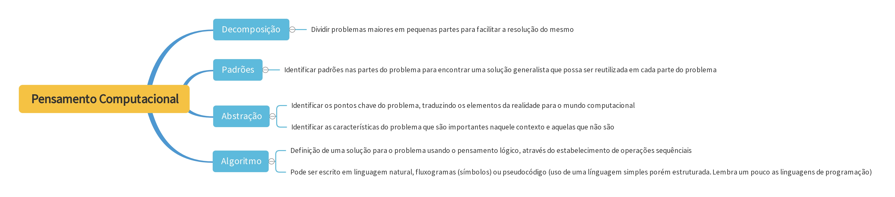
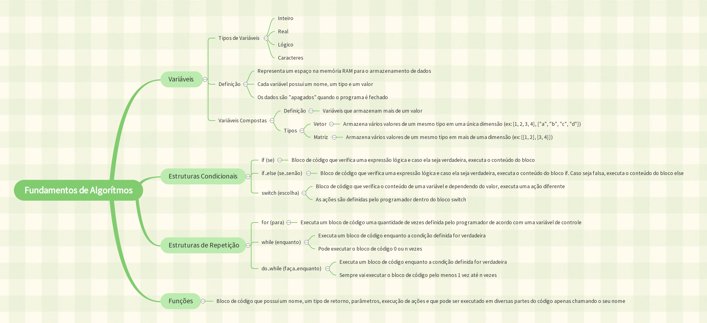

# Pensamento Computacional

 - [Overview](#overview)
 - [Fundamentos do Pensamento Computacional](#fundamentos-do-pensamento-computacional)
 - [Fundamentos de Algoritmos](#fundamentos-de-algoritmos)
 - [Orientação a Objetos](#orientação-a-objetos)


 ## Overview
O conteúdo deste arquivo se trata dos mapas mentais que eu criei durante as aulas do módulo de Pensamento Computacional do bootcamp. Alguns deles possui um código de exemplo para demonstrar na prática a teoria descrita nos mapas mentais.

 ## Fundamentos do Pensamento Computacional
 > Link do mapa mental: https://gitmind.com/app/doc/82811183360

 

 ## Fundamentos de Algoritmos
 > Link do mapa mental: https://gitmind.com/app/doc/79f11183431

 

 > O código abaixo está escrito em pseudocódigo

 ### Variáveis
 #### Variáveis Simples
 ```
    cadeia nome // Conjunto de caracteres
    caracter genero
    inteiro idade
    real peso
    logico possuiCarro
 ```

 #### Variáveis Complexas
 ```
    inteiro[5] notas
 ```
 
 ```
    inteiro[20][5] notasTurma
 ```

 ### Estruturas Condicionais

 #### if (se)
 ```
    real nota = 7.5

    se (nota > 6.0) {
        escreva("Aprovado")
    }
 ```

 #### if..else (se..senão)
 ```
    real nota = 5.5

    se (nota > 6.0) {
        escreva("Aprovado")
    } senao {
        escreva("Reprovado")
    }
 ```

 #### switch (escolha)
 ```
    inteiro opcao = 1

    escolha (opcao) {
	    caso 1:
	        escreva("Início")
	        pare
	    caso 2:
	        escreva("Configurações")
	        pare
	    caso contrario:
	        escreva("Voltar")
	}
 ```

 ### Estruturas de Repetição
 #### for (para)
 ```
    para(inteiro i = 0; i < 10; i++) {
        // Executa o código
    }
 ```

 #### while (enquanto)
 ```
    enquanto(condicao) {
        // Executa o código
    }
 ```

 #### do..while (faca..enquanto)
 ```
    faca {
        // Executa o código
    } enquanto(condicao)
 ```

 ### Funções
 ```
    funcao inicio() {
	    real mediaNotas = media(5.0, 3.0)
	    escreva("Média " + mediaNotas)
	}
	
	funcao real media(real n1, real n2) {
	    retorne (n1 + n2) / 2
	}
 ```

 ## Orientação a Objetos
 >  Link do mapa mental: https://gitmind.com/app/doc/d2211184122

 

 > O código abaixo está escrito em Java

 ### Classe
 ```
    public class Pessoa {

    }
 ```

 ### Objeto
 ```
    // Instanciação do objeto pessoa1
    Pessoa pessoa1 = new Pessoa();
 ```

 ### Atributo
 ```
    public class Pessoa {
        // Atributo nome com o tipo String (caracteres)
        String nome;
    }
 ```

 ### Método
 ```
    public class Calculadora() {
        // void é o tipo de retorno (não retorna nenhum valor)
        // n1 e n2 são os parâmetros
        void somar(double n1, double n2) {

        }
    }
 ```
 
 ### Encapsulamento
 ```
    public class Pessoa() {
        // Atributo privado (não é acessível nem visto por outras classes)
        private String nome;

        // Método Setter (usado para definir um valor para nome)
        public void setNome(String nome) {
            this.nome = nome;
        }

        // Método Getter (usado para obter o valor de nome)
        public String getNome() {
            return this.nome;
        }
    }
 ```

 ### Herança
 ```
    public class Funcionario {
        String nome;
        double salario;
    }

    // A classe Gerente herda os métodos e atributos de funcionário
    // por meio da palavra reservada extends
    class Gerente extends Funcionario {
        
    }
 ```

 ### Polimorfismo
 ```
    public class Funcionario {
        protected double salario;

        public double getSalario() {
            return salario;
        }
    }

    // A classe RepresentanteComercial tem o mesmo 
    // método getSalario, porém com implementação diferente
    // da classe funcionário.
    // Além disso, em um método que tenha como parâmetro
    // um objeto Funcionario, pode ser passado um objeto 
    // RepresentanteComercial, pois
    // RepresentanteComercial é um Funcionário
    public class RepresentanteComercial extends Funcionario {
        private double comissao;

        @Override
        public double getSalario() {
            return salario * comissao;
        }
    }
 ```

 ### Interface
 ```
    public interface Animal {
        public void fazerBarulho();
    }

    public class Cachorro implements Animal {
        @Override
        public void fazerBarulho() {
            System.out.println("Au Au Au");
        }
    }
 ```

 ### Composição
 ```
    // Carro é a classe TODO e Motor é a class PARTE
    // Se o objeto de Carro for excluído, o objeto
    // de Motor também será excluído
    public class Carro {
        Motor motor;
    }

    public class Motor {

    }
 ```

 ### Agregação
 ```
    // Equipe é a classe TODO e Jogador é a classe PARTE
    // Se o objeto da Equipe for excluído, o objeto do 
    // Jogador ainda continuará a existir
    public class Equipe {
        List<Jogador> jogadores;
    }

    public class Jogador {

    }
 ```
